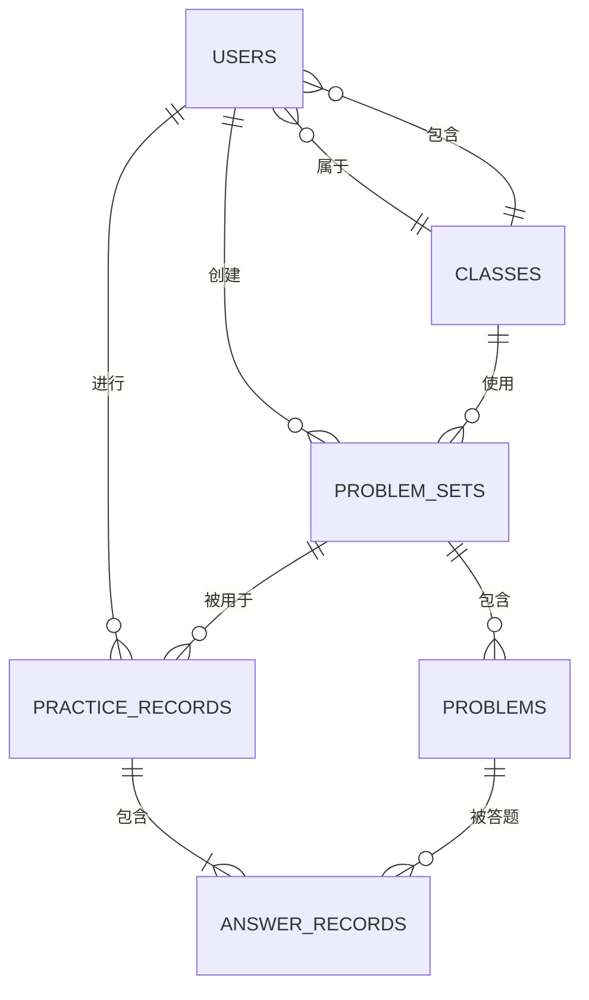
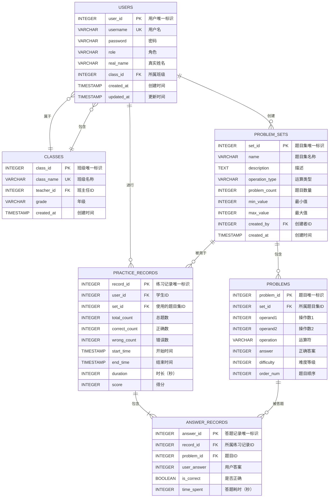

# 口算练习软件数据库设计文档

## 1. 系统用例图和用例描述

### 1.1 用例图

```mermaid
useCaseDiagram
    participant 学生 as 学生
    participant 家长 as 家长
    participant 老师 as 老师
    participant 系统 as 口算练习系统

    学生 --> 系统 : 使用交互练习
    学生 --> 系统 : 查看练习记录
    家长 --> 系统 : 生成练习题
    家长 --> 系统 : 查看孩子练习统计
    老师 --> 系统 : 查看班级统计
    老师 --> 系统 : 分析错题趋势
    老师 --> 系统 : 导出报告
```

### 1.2 用例描述

| 用例名称 | 参与者 | 描述 | 前置条件 | 后置条件 |
|---------|--------|------|---------|---------|
| 使用交互练习 | 学生 | 学生进行口算练习，答案自动保存到数据库 | 学生已登录 | 练习记录和答题记录被保存 |
| 查看练习记录 | 学生/家长 | 查看历史练习记录和统计 | 用户已登录 | 显示练习列表 |
| 生成练习题 | 家长/老师 | 生成题目并保存到数据库 | 用户已登录 | 题目集被保存 |
| 查看练习统计 | 家长 | 查看孩子的练习统计数据 | 用户已登录 | 显示统计报表 |
| 查看班级统计 | 老师 | 查看整个班级的练习统计 | 老师已登录 | 显示班级统计 |
| 分析错题趋势 | 老师 | 分析错误较多的题目 | 老师已登录 | 显示错题分析报告 |
| 导出报告 | 老师 | 导出统计报告 | 老师已登录 | 生成报告文件 |

---

## 2. 数据字典

### 2.1 实体定义

| 实体名称 | 说明 | 所属模块 |
|---------|------|---------|
| 用户 | 使用系统的人员（学生、家长、老师） | 用户管理 |
| 题目集 | 一组练习题的集合 | 题目管理 |
| 题目 | 单个口算题目 | 题目管理 |
| 练习记录 | 一次练习的记录 | 练习管理 |
| 答题记录 | 每道题的答题情况 | 练习管理 |

### 2.2 属性定义

#### 2.2.1 用户表 (users)

| 属性名 | 类型 | 约束 | 说明 |
|--------|------|------|------|
| user_id | INTEGER | PRIMARY KEY AUTOINCREMENT | 用户唯一标识 |
| username | VARCHAR(50) | NOT NULL UNIQUE | 用户名 |
| password | VARCHAR(100) | NOT NULL | 密码（加密存储） |
| role | VARCHAR(20) | NOT NULL DEFAULT 'student' | 用户角色：student/parent/teacher |
| real_name | VARCHAR(50) | | 真实姓名 |
| class_id | INTEGER | FOREIGN KEY | 所属班级（学生） |
| created_at | TIMESTAMP | NOT NULL DEFAULT CURRENT_TIMESTAMP | 创建时间 |
| updated_at | TIMESTAMP | NOT NULL DEFAULT CURRENT_TIMESTAMP | 更新时间 |

#### 2.2.2 班级表 (classes)

| 属性名 | 类型 | 约束 | 说明 |
|--------|------|------|------|
| class_id | INTEGER | PRIMARY KEY AUTOINCREMENT | 班级唯一标识 |
| class_name | VARCHAR(50) | NOT NULL UNIQUE | 班级名称 |
| teacher_id | INTEGER | FOREIGN KEY | 班主任ID |
| grade | VARCHAR(20) | | 年级 |
| created_at | TIMESTAMP | NOT NULL DEFAULT CURRENT_TIMESTAMP | 创建时间 |

#### 2.2.3 题目集表 (problem_sets)

| 属性名 | 类型 | 约束 | 说明 |
|--------|------|------|------|
| set_id | INTEGER | PRIMARY KEY AUTOINCREMENT | 题目集唯一标识 |
| name | VARCHAR(100) | NOT NULL | 题目集名称 |
| description | TEXT | | 描述 |
| operation_type | VARCHAR(20) | NOT NULL | 运算类型：addition/subtraction/multiplication/mixed |
| problem_count | INTEGER | NOT NULL DEFAULT 50 | 题目数量 |
| min_value | INTEGER | NOT NULL DEFAULT 1 | 最小值 |
| max_value | INTEGER | NOT NULL DEFAULT 100 | 最大值 |
| created_by | INTEGER | FOREIGN KEY | 创建者ID |
| created_at | TIMESTAMP | NOT NULL DEFAULT CURRENT_TIMESTAMP | 创建时间 |

#### 2.2.4 题目表 (problems)

| 属性名 | 类型 | 约束 | 说明 |
|--------|------|------|------|
| problem_id | INTEGER | PRIMARY KEY AUTOINCREMENT | 题目唯一标识 |
| set_id | INTEGER | FOREIGN KEY NOT NULL | 所属题目集ID |
| operand1 | INTEGER | NOT NULL | 操作数1 |
| operand2 | INTEGER | NOT NULL | 操作数2 |
| operation | VARCHAR(10) | NOT NULL | 运算符：+/-/* |
| answer | INTEGER | NOT NULL | 正确答案 |
| difficulty | INTEGER | DEFAULT 1 | 难度等级（1-5） |
| order_num | INTEGER | NOT NULL | 题目顺序 |

#### 2.2.5 练习记录表 (practice_records)

| 属性名 | 类型 | 约束 | 说明 |
|--------|------|------|------|
| record_id | INTEGER | PRIMARY KEY AUTOINCREMENT | 练习记录唯一标识 |
| user_id | INTEGER | FOREIGN KEY NOT NULL | 学生ID |
| set_id | INTEGER | FOREIGN KEY | 使用的题目集ID |
| total_count | INTEGER | NOT NULL | 总题数 |
| correct_count | INTEGER | NOT NULL DEFAULT 0 | 正确数 |
| wrong_count | INTEGER | NOT NULL DEFAULT 0 | 错误数 |
| start_time | TIMESTAMP | NOT NULL | 开始时间 |
| end_time | TIMESTAMP | | 结束时间 |
| duration | INTEGER | | 时长（秒） |
| score | INTEGER | | 得分（0-100） |

#### 2.2.6 答题记录表 (answer_records)

| 属性名 | 类型 | 约束 | 说明 |
|--------|------|------|------|
| answer_id | INTEGER | PRIMARY KEY AUTOINCREMENT | 答题记录唯一标识 |
| record_id | INTEGER | FOREIGN KEY NOT NULL | 所属练习记录ID |
| problem_id | INTEGER | FOREIGN KEY NOT NULL | 题目ID |
| user_answer | INTEGER | | 用户答案 |
| is_correct | BOOLEAN | NOT NULL DEFAULT FALSE | 是否正确 |
| time_spent | INTEGER | | 答题耗时（秒） |

---

## 3. 数据概念设计

### 3.1 概念模型 (ER图)



### 3.2 实体关系说明

| 关系 | 实体1 | 实体2 | 基数 | 说明 |
|------|-------|-------|------|------|
| 进行 | 用户 | 练习记录 | 1:N | 一个用户可以有多个练习记录 |
| 创建 | 用户 | 题目集 | 1:N | 一个用户可以创建多个题目集 |
| 属于 | 用户 | 班级 | N:1 | 多个用户属于一个班级 |
| 包含 | 班级 | 用户 | 1:N | 一个班级包含多个学生 |
| 使用 | 班级 | 题目集 | N:M | 多个班级可以使用多个题目集 |
| 包含 | 题目集 | 题目 | 1:N | 一个题目集包含多个题目 |
| 被用于 | 题目集 | 练习记录 | 1:N | 一个题目集可以被多次使用 |
| 包含 | 练习记录 | 答题记录 | 1:N | 一次练习包含多条答题记录 |
| 被答题 | 题目 | 答题记录 | 1:N | 一道题可以被多次回答 |

---

## 4. 数据逻辑设计

### 4.1 关系模式

```sql
-- 用户表
CREATE TABLE users (
    user_id INTEGER PRIMARY KEY AUTOINCREMENT,
    username VARCHAR(50) NOT NULL UNIQUE,
    password VARCHAR(100) NOT NULL,
    role VARCHAR(20) NOT NULL DEFAULT 'student',
    real_name VARCHAR(50),
    class_id INTEGER,
    created_at TIMESTAMP NOT NULL DEFAULT CURRENT_TIMESTAMP,
    updated_at TIMESTAMP NOT NULL DEFAULT CURRENT_TIMESTAMP,
    FOREIGN KEY (class_id) REFERENCES classes(class_id)
);

-- 班级表
CREATE TABLE classes (
    class_id INTEGER PRIMARY KEY AUTOINCREMENT,
    class_name VARCHAR(50) NOT NULL UNIQUE,
    teacher_id INTEGER,
    grade VARCHAR(20),
    created_at TIMESTAMP NOT NULL DEFAULT CURRENT_TIMESTAMP,
    FOREIGN KEY (teacher_id) REFERENCES users(user_id)
);

-- 题目集表
CREATE TABLE problem_sets (
    set_id INTEGER PRIMARY KEY AUTOINCREMENT,
    name VARCHAR(100) NOT NULL,
    description TEXT,
    operation_type VARCHAR(20) NOT NULL,
    problem_count INTEGER NOT NULL DEFAULT 50,
    min_value INTEGER NOT NULL DEFAULT 1,
    max_value INTEGER NOT NULL DEFAULT 100,
    created_by INTEGER,
    created_at TIMESTAMP NOT NULL DEFAULT CURRENT_TIMESTAMP,
    FOREIGN KEY (created_by) REFERENCES users(user_id)
);

-- 题目表
CREATE TABLE problems (
    problem_id INTEGER PRIMARY KEY AUTOINCREMENT,
    set_id INTEGER NOT NULL,
    operand1 INTEGER NOT NULL,
    operand2 INTEGER NOT NULL,
    operation VARCHAR(10) NOT NULL,
    answer INTEGER NOT NULL,
    difficulty INTEGER DEFAULT 1,
    order_num INTEGER NOT NULL,
    FOREIGN KEY (set_id) REFERENCES problem_sets(set_id)
);

-- 练习记录表
CREATE TABLE practice_records (
    record_id INTEGER PRIMARY KEY AUTOINCREMENT,
    user_id INTEGER NOT NULL,
    set_id INTEGER,
    total_count INTEGER NOT NULL,
    correct_count INTEGER NOT NULL DEFAULT 0,
    wrong_count INTEGER NOT NULL DEFAULT 0,
    start_time TIMESTAMP NOT NULL,
    end_time TIMESTAMP,
    duration INTEGER,
    score INTEGER,
    FOREIGN KEY (user_id) REFERENCES users(user_id),
    FOREIGN KEY (set_id) REFERENCES problem_sets(set_id)
);

-- 答题记录表
CREATE TABLE answer_records (
    answer_id INTEGER PRIMARY KEY AUTOINCREMENT,
    record_id INTEGER NOT NULL,
    problem_id INTEGER NOT NULL,
    user_answer INTEGER,
    is_correct BOOLEAN NOT NULL DEFAULT FALSE,
    time_spent INTEGER,
    FOREIGN KEY (record_id) REFERENCES practice_records(record_id),
    FOREIGN KEY (problem_id) REFERENCES problems(problem_id)
);
```

### 4.2 索引设计

```sql
-- 用户表索引
CREATE INDEX idx_users_username ON users(username);
CREATE INDEX idx_users_role ON users(role);
CREATE INDEX idx_users_class_id ON users(class_id);

-- 班级表索引
CREATE INDEX idx_classes_class_name ON classes(class_name);
CREATE INDEX idx_classes_teacher_id ON classes(teacher_id);

-- 题目集表索引
CREATE INDEX idx_problem_sets_created_by ON problem_sets(created_by);
CREATE INDEX idx_problem_sets_operation_type ON problem_sets(operation_type);

-- 题目表索引
CREATE INDEX idx_problems_set_id ON problems(set_id);
CREATE INDEX idx_problems_difficulty ON problems(difficulty);

-- 练习记录表索引
CREATE INDEX idx_practice_records_user_id ON practice_records(user_id);
CREATE INDEX idx_practice_records_set_id ON practice_records(set_id);
CREATE INDEX idx_practice_records_start_time ON practice_records(start_time);

-- 答题记录表索引
CREATE INDEX idx_answer_records_record_id ON answer_records(record_id);
CREATE INDEX idx_answer_records_problem_id ON answer_records(problem_id);
CREATE INDEX idx_answer_records_is_correct ON answer_records(is_correct);
```

---

## 5. 数据物理设计

### 5.1 数据库选择

- **数据库类型**: SQLite 3.x
- **文件位置**: `data/practice.db`
- **编码格式**: UTF-8

### 5.2 表空间设计

由于SQLite是嵌入式数据库，不需要单独的表空间管理，数据文件直接存储在文件系统中。

### 5.3 存储参数

| 参数 | 值 | 说明 |
|------|-----|------|
| 页面大小 | 4KB | 默认值，适合大多数场景 |
| 缓存大小 | 2000页 | 约8MB内存缓存 |
| 同步模式 | FULL | 确保数据安全 |
| 日志模式 | WAL | 提高并发性能 |

---

## 6. SQLite数据库实现

### 6.1 数据库连接字符串

```python
database_path = "data/practice.db"
connection = sqlite3.connect(database_path)
```

### 6.2 数据库初始化脚本

```python
import sqlite3
import os

def init_database():
    # 确保数据目录存在
    os.makedirs('data', exist_ok=True)
    
    # 连接数据库
    conn = sqlite3.connect('data/practice.db')
    cursor = conn.cursor()
    
    # 创建表
    cursor.execute('''
        CREATE TABLE IF NOT EXISTS users (
            user_id INTEGER PRIMARY KEY AUTOINCREMENT,
            username VARCHAR(50) NOT NULL UNIQUE,
            password VARCHAR(100) NOT NULL,
            role VARCHAR(20) NOT NULL DEFAULT 'student',
            real_name VARCHAR(50),
            class_id INTEGER,
            created_at TIMESTAMP NOT NULL DEFAULT CURRENT_TIMESTAMP,
            updated_at TIMESTAMP NOT NULL DEFAULT CURRENT_TIMESTAMP,
            FOREIGN KEY (class_id) REFERENCES classes(class_id)
        )
    ''')
    
    cursor.execute('''
        CREATE TABLE IF NOT EXISTS classes (
            class_id INTEGER PRIMARY KEY AUTOINCREMENT,
            class_name VARCHAR(50) NOT NULL UNIQUE,
            teacher_id INTEGER,
            grade VARCHAR(20),
            created_at TIMESTAMP NOT NULL DEFAULT CURRENT_TIMESTAMP,
            FOREIGN KEY (teacher_id) REFERENCES users(user_id)
        )
    ''')
    
    cursor.execute('''
        CREATE TABLE IF NOT EXISTS problem_sets (
            set_id INTEGER PRIMARY KEY AUTOINCREMENT,
            name VARCHAR(100) NOT NULL,
            description TEXT,
            operation_type VARCHAR(20) NOT NULL,
            problem_count INTEGER NOT NULL DEFAULT 50,
            min_value INTEGER NOT NULL DEFAULT 1,
            max_value INTEGER NOT NULL DEFAULT 100,
            created_by INTEGER,
            created_at TIMESTAMP NOT NULL DEFAULT CURRENT_TIMESTAMP,
            FOREIGN KEY (created_by) REFERENCES users(user_id)
        )
    ''')
    
    cursor.execute('''
        CREATE TABLE IF NOT EXISTS problems (
            problem_id INTEGER PRIMARY KEY AUTOINCREMENT,
            set_id INTEGER NOT NULL,
            operand1 INTEGER NOT NULL,
            operand2 INTEGER NOT NULL,
            operation VARCHAR(10) NOT NULL,
            answer INTEGER NOT NULL,
            difficulty INTEGER DEFAULT 1,
            order_num INTEGER NOT NULL,
            FOREIGN KEY (set_id) REFERENCES problem_sets(set_id)
        )
    ''')
    
    cursor.execute('''
        CREATE TABLE IF NOT EXISTS practice_records (
            record_id INTEGER PRIMARY KEY AUTOINCREMENT,
            user_id INTEGER NOT NULL,
            set_id INTEGER,
            total_count INTEGER NOT NULL,
            correct_count INTEGER NOT NULL DEFAULT 0,
            wrong_count INTEGER NOT NULL DEFAULT 0,
            start_time TIMESTAMP NOT NULL,
            end_time TIMESTAMP,
            duration INTEGER,
            score INTEGER,
            FOREIGN KEY (user_id) REFERENCES users(user_id),
            FOREIGN KEY (set_id) REFERENCES problem_sets(set_id)
        )
    ''')
    
    cursor.execute('''
        CREATE TABLE IF NOT EXISTS answer_records (
            answer_id INTEGER PRIMARY KEY AUTOINCREMENT,
            record_id INTEGER NOT NULL,
            problem_id INTEGER NOT NULL,
            user_answer INTEGER,
            is_correct BOOLEAN NOT NULL DEFAULT FALSE,
            time_spent INTEGER,
            FOREIGN KEY (record_id) REFERENCES practice_records(record_id),
            FOREIGN KEY (problem_id) REFERENCES problems(problem_id)
        )
    ''')
    
    # 创建索引
    cursor.execute('CREATE INDEX IF NOT EXISTS idx_users_username ON users(username)')
    cursor.execute('CREATE INDEX IF NOT EXISTS idx_users_role ON users(role)')
    cursor.execute('CREATE INDEX IF NOT EXISTS idx_users_class_id ON users(class_id)')
    cursor.execute('CREATE INDEX IF NOT EXISTS idx_classes_class_name ON classes(class_name)')
    cursor.execute('CREATE INDEX IF NOT EXISTS idx_problem_sets_created_by ON problem_sets(created_by)')
    cursor.execute('CREATE INDEX IF NOT EXISTS idx_problem_sets_operation_type ON problem_sets(operation_type)')
    cursor.execute('CREATE INDEX IF NOT EXISTS idx_problems_set_id ON problems(set_id)')
    cursor.execute('CREATE INDEX IF NOT EXISTS idx_practice_records_user_id ON practice_records(user_id)')
    cursor.execute('CREATE INDEX IF NOT EXISTS idx_practice_records_start_time ON practice_records(start_time)')
    cursor.execute('CREATE INDEX IF NOT EXISTS idx_answer_records_record_id ON answer_records(record_id)')
    cursor.execute('CREATE INDEX IF NOT EXISTS idx_answer_records_problem_id ON answer_records(problem_id)')
    
    conn.commit()
    conn.close()
```

---

## 7. 数据处理语句

### 7.1 插入数据

```sql
-- 插入用户
INSERT INTO users (username, password, role, real_name, class_id)
VALUES ('student001', 'encrypted_password', 'student', '小明', 1);

-- 插入班级
INSERT INTO classes (class_name, teacher_id, grade)
VALUES ('三年级一班', 1, '三年级');

-- 插入题目集
INSERT INTO problem_sets (name, description, operation_type, problem_count, min_value, max_value, created_by)
VALUES ('加法练习-入门', '10以内加法练习', 'addition', 50, 1, 10, 2);

-- 插入题目
INSERT INTO problems (set_id, operand1, operand2, operation, answer, difficulty, order_num)
VALUES (1, 3, 5, '+', 8, 1, 1);

-- 插入练习记录
INSERT INTO practice_records (user_id, set_id, total_count, correct_count, wrong_count, start_time, end_time, duration, score)
VALUES (1, 1, 50, 45, 5, '2024-01-15 10:00:00', '2024-01-15 10:15:00', 900, 90);

-- 插入答题记录
INSERT INTO answer_records (record_id, problem_id, user_answer, is_correct, time_spent)
VALUES (1, 1, 8, TRUE, 5);
```

### 7.2 查询数据

```sql
-- 查询学生练习统计
SELECT 
    u.real_name,
    COUNT(pr.record_id) as practice_count,
    AVG(pr.score) as avg_score,
    SUM(pr.total_count) as total_problems,
    SUM(pr.correct_count) as correct_problems
FROM users u
LEFT JOIN practice_records pr ON u.user_id = pr.user_id
WHERE u.role = 'student'
GROUP BY u.user_id;

-- 查询错题分析（错误率最高的题目）
SELECT 
    p.operand1,
    p.operation,
    p.operand2,
    p.answer,
    COUNT(*) as total_attempts,
    SUM(CASE WHEN ar.is_correct = FALSE THEN 1 ELSE 0 END) as wrong_count,
    ROUND(SUM(CASE WHEN ar.is_correct = FALSE THEN 1 ELSE 0 END) * 100.0 / COUNT(*), 2) as wrong_rate
FROM problems p
JOIN answer_records ar ON p.problem_id = ar.problem_id
GROUP BY p.problem_id
ORDER BY wrong_rate DESC
LIMIT 10;

-- 查询班级统计
SELECT 
    c.class_name,
    COUNT(DISTINCT u.user_id) as student_count,
    COUNT(pr.record_id) as total_practices,
    AVG(pr.score) as avg_score
FROM classes c
LEFT JOIN users u ON c.class_id = u.class_id
LEFT JOIN practice_records pr ON u.user_id = pr.user_id
GROUP BY c.class_id;
```

### 7.3 更新数据

```sql
-- 更新练习记录（练习完成时）
UPDATE practice_records
SET end_time = '2024-01-15 10:15:00',
    duration = 900,
    correct_count = 45,
    wrong_count = 5,
    score = 90
WHERE record_id = 1;

-- 更新用户信息
UPDATE users
SET real_name = '小明同学',
    updated_at = CURRENT_TIMESTAMP
WHERE user_id = 1;
```

### 7.4 删除数据

```sql
-- 删除练习记录（级联删除答题记录）
DELETE FROM practice_records WHERE record_id = 1;
DELETE FROM answer_records WHERE record_id = 1;

-- 删除题目集（级联删除题目）
DELETE FROM problem_sets WHERE set_id = 1;
DELETE FROM problems WHERE set_id = 1;
```

---

## 8. 数据库链接设计

### 8.1 数据库连接管理

```python
import sqlite3
from contextlib import contextmanager
from typing import Optional

class DatabaseManager:
    _instance = None
    _connection = None
    
    def __new__(cls):
        if cls._instance is None:
            cls._instance = super(DatabaseManager, cls).__new__(cls)
        return cls._instance
    
    @contextmanager
    def get_connection(self):
        if self._connection is None:
            self._connection = sqlite3.connect('data/practice.db')
            self._connection.row_factory = sqlite3.Row
        try:
            yield self._connection
        finally:
            # 不关闭连接，保持连接复用
            pass
    
    def close_connection(self):
        if self._connection is not None:
            self._connection.close()
            self._connection = None

# 使用示例
db = DatabaseManager()
with db.get_connection() as conn:
    cursor = conn.cursor()
    cursor.execute("SELECT * FROM users")
    rows = cursor.fetchall()
```

### 8.2 DAO层设计

```python
class UserDAO:
    def __init__(self, db_manager):
        self.db_manager = db_manager
    
    def get_user_by_id(self, user_id):
        with self.db_manager.get_connection() as conn:
            cursor = conn.cursor()
            cursor.execute("SELECT * FROM users WHERE user_id = ?", (user_id,))
            return cursor.fetchone()
    
    def get_user_by_username(self, username):
        with self.db_manager.get_connection() as conn:
            cursor = conn.cursor()
            cursor.execute("SELECT * FROM users WHERE username = ?", (username,))
            return cursor.fetchone()
    
    def create_user(self, username, password, role='student', real_name=None, class_id=None):
        with self.db_manager.get_connection() as conn:
            cursor = conn.cursor()
            cursor.execute('''
                INSERT INTO users (username, password, role, real_name, class_id)
                VALUES (?, ?, ?, ?, ?)
            ''', (username, password, role, real_name, class_id))
            conn.commit()
            return cursor.lastrowid
    
    def update_user(self, user_id, **kwargs):
        with self.db_manager.get_connection() as conn:
            cursor = conn.cursor()
            fields = ', '.join(f"{k} = ?" for k in kwargs.keys())
            values = list(kwargs.values()) + [user_id]
            cursor.execute(f"UPDATE users SET {fields} WHERE user_id = ?", values)
            conn.commit()
            return cursor.rowcount
    
    def delete_user(self, user_id):
        with self.db_manager.get_connection() as conn:
            cursor = conn.cursor()
            cursor.execute("DELETE FROM users WHERE user_id = ?", (user_id,))
            conn.commit()
            return cursor.rowcount
```

---

## 9. 测试数据和单元测试

### 9.1 测试数据

```python
# 测试用户数据
test_users = [
    {'username': 'teacher1', 'password': 'teacher_pass', 'role': 'teacher', 'real_name': '张老师'},
    {'username': 'parent1', 'password': 'parent_pass', 'role': 'parent', 'real_name': '华经理'},
    {'username': 'student1', 'password': 'student_pass', 'role': 'student', 'real_name': '小明'},
]

# 测试班级数据
test_classes = [
    {'class_name': '三年级一班', 'teacher_id': 1, 'grade': '三年级'},
]

# 测试题目集数据
test_problem_sets = [
    {'name': '加法入门练习', 'description': '10以内加法', 'operation_type': 'addition', 'problem_count': 10, 'min_value': 1, 'max_value': 10, 'created_by': 2},
]

# 测试题目数据
test_problems = [
    {'set_id': 1, 'operand1': 1, 'operand2': 2, 'operation': '+', 'answer': 3, 'difficulty': 1, 'order_num': 1},
    {'set_id': 1, 'operand1': 3, 'operand2': 5, 'operation': '+', 'answer': 8, 'difficulty': 1, 'order_num': 2},
    {'set_id': 1, 'operand1': 7, 'operand2': 9, 'operation': '+', 'answer': 16, 'difficulty': 1, 'order_num': 3},
]
```

### 9.2 单元测试示例

```python
import unittest
import sqlite3
import os

class TestDatabase(unittest.TestCase):
    def setUp(self):
        # 创建测试数据库
        self.db_path = 'data/test_practice.db'
        os.makedirs('data', exist_ok=True)
        self.conn = sqlite3.connect(self.db_path)
        self._create_tables()
        self._insert_test_data()
    
    def _create_tables(self):
        cursor = self.conn.cursor()
        cursor.execute('''
            CREATE TABLE users (
                user_id INTEGER PRIMARY KEY AUTOINCREMENT,
                username VARCHAR(50) NOT NULL UNIQUE,
                password VARCHAR(100) NOT NULL,
                role VARCHAR(20) NOT NULL DEFAULT 'student',
                real_name VARCHAR(50),
                class_id INTEGER
            )
        ''')
        cursor.execute('''
            CREATE TABLE practice_records (
                record_id INTEGER PRIMARY KEY AUTOINCREMENT,
                user_id INTEGER NOT NULL,
                total_count INTEGER NOT NULL,
                correct_count INTEGER NOT NULL DEFAULT 0,
                wrong_count INTEGER NOT NULL DEFAULT 0,
                score INTEGER
            )
        ''')
        self.conn.commit()
    
    def _insert_test_data(self):
        cursor = self.conn.cursor()
        cursor.execute('INSERT INTO users (username, password, role, real_name) VALUES (?, ?, ?, ?)',
                      ('test_user', 'test_pass', 'student', '测试用户'))
        self.conn.commit()
    
    def test_insert_user(self):
        cursor = self.conn.cursor()
        cursor.execute('INSERT INTO users (username, password, role, real_name) VALUES (?, ?, ?, ?)',
                      ('new_user', 'new_pass', 'student', '新用户'))
        self.conn.commit()
        
        cursor.execute('SELECT * FROM users WHERE username = ?', ('new_user',))
        user = cursor.fetchone()
        
        self.assertIsNotNone(user)
        self.assertEqual(user[1], 'new_user')
        self.assertEqual(user[3], '新用户')
    
    def test_get_user(self):
        cursor = self.conn.cursor()
        cursor.execute('SELECT * FROM users WHERE username = ?', ('test_user',))
        user = cursor.fetchone()
        
        self.assertIsNotNone(user)
        self.assertEqual(user[2], 'test_pass')
    
    def test_practice_record(self):
        cursor = self.conn.cursor()
        cursor.execute('INSERT INTO practice_records (user_id, total_count, correct_count, wrong_count, score) VALUES (?, ?, ?, ?, ?)',
                      (1, 10, 8, 2, 80))
        self.conn.commit()
        
        cursor.execute('SELECT * FROM practice_records WHERE user_id = ?', (1,))
        record = cursor.fetchone()
        
        self.assertIsNotNone(record)
        self.assertEqual(record[2], 10)
        self.assertEqual(record[3], 8)
        self.assertEqual(record[5], 80)
    
    def tearDown(self):
        self.conn.close()
        if os.path.exists(self.db_path):
            os.remove(self.db_path)

if __name__ == '__main__':
    unittest.main()
```

---

## 10. Git代码管理和编程规范

### 10.1 Git工作流

```
main (生产分支)
    ↓
develop (开发分支)
    ↓
feature/* (功能分支)
```

### 10.2 提交规范

```
feat: 新增功能
fix: 修复bug
docs: 更新文档
style: 代码格式化
refactor: 代码重构
test: 添加测试
chore: 构建/工具更新
```

### 10.3 编程规范要点

| 规范项 | 要求 |
|--------|------|
| 命名 | 类名使用PascalCase，函数和变量使用snake_case |
| 注释 | 每个类和函数必须有文档字符串 |
| 类型提示 | 所有函数参数和返回值必须有类型提示 |
| 异常处理 | 数据库操作必须有try-except捕获 |
| 代码风格 | 遵循PEP8规范 |
| 连接管理 | 使用上下文管理器管理数据库连接 |

---

## 附录：ER图完整版

