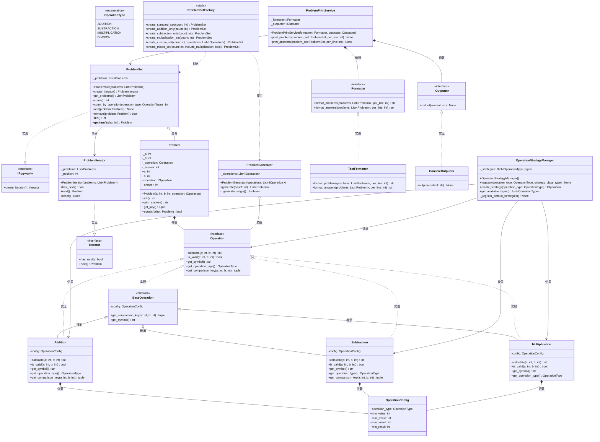

# UML类图设计文档

## 口算练习题生成器 - 类图

本系统采用面向对象设计，遵循SOLID原则，应用多种设计模式。

## 类关系说明

### 1. 继承关系 (Inheritance)
- `BaseOperation` 作为抽象基类，定义运算的通用行为
- `Addition`, `Subtraction`, `Multiplication` 继承自 `BaseOperation`
- 应用**模板方法模式**，基类提供默认实现，子类可重写

### 2. 实现关系 (Implementation)
- `IOperation` 是运算接口（Python中用Protocol模拟）
- `Addition`, `Subtraction`, `Multiplication` 实现 `IOperation` 接口
- 应用**策略模式**，不同运算作为不同的策略

### 3. 依赖关系 (Dependency)
- `Problem` 依赖 `IOperation` 接口，而非具体实现（依赖倒转原则）
- `ProblemGenerator` 依赖 `IOperation` 列表
- `ProblemPrintService` 依赖 `IFormatter` 和 `IOutputter` 接口

### 4. 聚合关系 (Aggregation)
- `ProblemSet` 聚合多个 `Problem` 对象
- `ProblemSet` 可以独立于 `Problem` 存在

### 5. 组合关系 (Composition)
- `Problem` 组合 `IOperation` 对象
- `Problem` 不存在时，`IOperation` 对象也可能被释放

## 设计模式应用

### 1. 策略模式 (Strategy Pattern)
- **接口**: `IOperation`
- **具体策略**: `Addition`, `Subtraction`, `Multiplication`
- **上下文**: `OperationStrategyManager`
- **用途**: 运行时选择不同的运算策略

### 2. 工厂模式 (Factory Pattern)
- **工厂类**: `ProblemSetFactory`
- **产品**: `ProblemSet`
- **用途**: 集中管理问题集的创建逻辑

### 3. 迭代器模式 (Iterator Pattern)
- **迭代器接口**: `IIterator`
- **具体迭代器**: `ProblemIterator`
- **聚合接口**: `IAggregate`
- **具体聚合**: `ProblemSet`
- **用途**: 提供对问题集的统一遍历方式

### 4. 模板方法模式 (Template Method Pattern)
- **抽象类**: `BaseOperation`
- **具体类**: `Addition`, `Subtraction`, `Multiplication`
- **用途**: 定义算法骨架，子类实现具体步骤

### 5. 门面模式 (Facade Pattern)
- **门面**: `ProblemPrintService`
- **子系统**: `TextFormatter`, `ConsoleOutputter`
- **用途**: 简化格式化和输出的复杂调用

## SOLID原则体现

### 单一职责原则 (SRP)
- `Problem`: 只负责表示一道算式
- `ProblemGenerator`: 只负责生成问题
- `ProblemSet`: 只负责管理问题集
- `TextFormatter`: 只负责格式化
- `ConsoleOutputter`: 只负责输出

### 开放封闭原则 (OCP)
- 通过 `IOperation` 接口，可以轻松添加新的运算类型（如乘法、除法）
- 通过 `IFormatter` 接口，可以添加新的格式化器（如HTML、PDF）
- 通过 `IOutputter` 接口，可以添加新的输出方式（如文件、网络）

### 里氏代换原则 (LSP)
- `Addition`, `Subtraction`, `Multiplication` 都可以替换 `IOperation`
- 迭代器可以替换 `IIterator`

### 接口隔离原则 (ISP)
- `IOperation`: 只包含运算相关的操作
- `IFormatter`: 只包含格式化相关的操作
- `IOutputter`: 只包含输出相关的操作
- `IIterator`: 只包含迭代相关的操作

### 依赖倒转原则 (DIP)
- `Problem` 依赖 `IOperation` 抽象，而非具体运算类
- `ProblemGenerator` 依赖 `IOperation` 抽象
- `ProblemPrintService` 依赖 `IFormatter` 和 `IOutputter` 抽象

## 抽象数据类型 (ADT)

### OperationType
- 枚举类型，表示不同的运算类型
- 类型安全的运算标识

### OperationConfig
- 数据类，封装运算配置
- 作为运算策略的参数传递

### Problem
- 封装算式的完整信息
- 提供只读属性，保证不可变性
- 自我封装计算逻辑

## 多态性应用

### 运行时多态
- `ProblemGenerator` 可以处理任何实现 `IOperation` 的策略
- `ProblemPrintService` 可以使用任何 `IFormatter` 和 `IOutputter`

### 参数化多态
- `ProblemSet` 可以存储任何 `Problem` 对象
- 泛型接口支持不同类型的数据处理